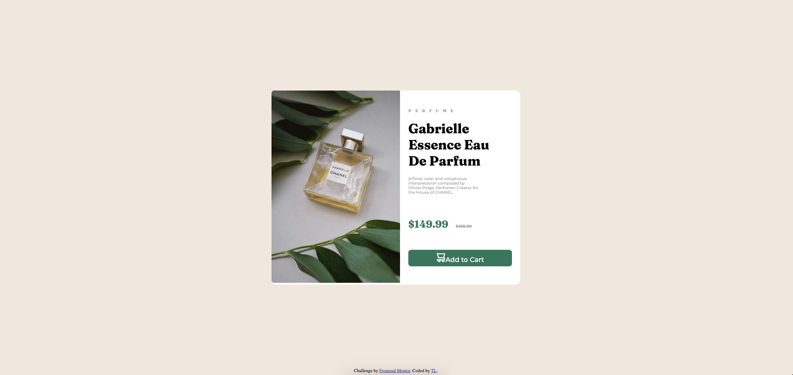

# Frontend Mentor - Product preview card component solution

This is a solution to the [Product preview card component challenge on Frontend Mentor](https://www.frontendmentor.io/challenges/product-preview-card-component-GO7UmttRfa). Frontend Mentor challenges help you improve your coding skills by building realistic projects. 

## Table of contents

- [Overview](#overview)
  - [The challenge](#the-challenge)
  - [Screenshot](#screenshot)
  - [Links](#links)
- [My process](#my-process)
  - [Built with](#built-with)
  - [What I learned](#what-i-learned)
  - [Continued development](#continued-development)
  - [Useful resources](#useful-resources)
- [Author](#author)
- [Acknowledgments](#acknowledgments)

**Note: Delete this note and update the table of contents based on what sections you keep.**

## Overview

### The challenge

Users should be able to:

- View the optimal layout depending on their device's screen size
- See hover and focus states for interactive elements

### Screenshot

### Links

- Solution URL: [Add solution URL here](https://github.com/wheels63/fm-product-preview-card-component-main)
- Live Site URL: [Add live site URL here](https://fmproduct-preview-card-component-main.netlify.app/)

## My process

### Built with

- Semantic HTML5 markup
- CSS custom properties
- Flexbox
- CSS Grid

### What I learned

1. I applied roles attributes to improve accessibility features. 

  

  

  

2. To get any element to center vertically and horizontally:
- Used absolute positioning, with top and left parameters set to 50%, and adding a transform: translate(-50%, -50%)

.main-card {
    position: absolute;
    top: 50%;
    left: 50%;
    transform: translate(-50%, -50%);
}

### Continued development

Need more practice!
Learn from other solutions.

### Useful resources

## Author

- Frontend Mentor - [@yourusername](https://www.frontendmentor.io/profile/wheels63)

## Acknowledgments

big ups to frontendmentor.io for putting this free resource together!